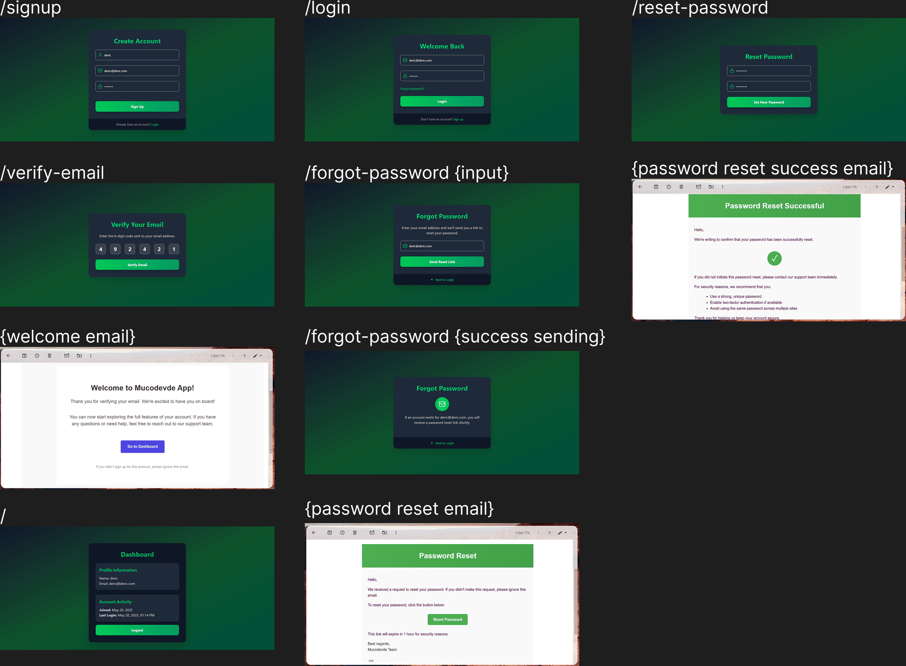

# MERN AUTH API SERVICES

## Overview

**MERN AUTH API SERVICES** is an Authentication API service, commonly used as the core user management system in web or mobile applications.

## Features

### ✅ Current Features:
- A User Authentication and Authorization Service
- Includes core features:
  - Signup/Login/Logout
  - Email Verification
  - Forgot/Reset Password
  - Auth Check via JWT

## Installation

To get started with the **MERN AUTH API SERVICES Web**, follow these steps:

1. **Clone the repository:**

    ```bash
    git clone https://github.com/muhammadderic/mern_auth_api_services.git
    cd mern_auth_api_services
    ```

2. **Install dependencies:**

    ```bash
    npm install
    ```

3. **Run the development server:**

    ```bash
    npm run dev
    ```

    Run [http://localhost:5000](http://localhost:5173) to start server, then visit [http://localhost:3000](http://localhost:3000) to see the pages.

## Screenshots

<div style="display: flex; justify-content: space-between;">
    
</div>

*Screenshot description*

## Technologies Used

- **MERN Stack** – MongoDB, Express, React, and Node.js for full-stack development
- **Resend library** – For email functionality

## Contributing

Contributions are welcome! If you'd like to contribute to this project, please follow these steps:

1. Fork the repository.
2. Create a new branch for your feature or bugfix.
3. Commit your changes and push your branch.
4. Open a pull request to have your changes reviewed.

## License

This project is licensed under the MIT License. See the [LICENSE](LICENSE) file for more details.

## Contact

If you have any questions or suggestions, feel free to reach out:

- **GitHub**: [muhammadderic](https://github.com/muhammadderic)